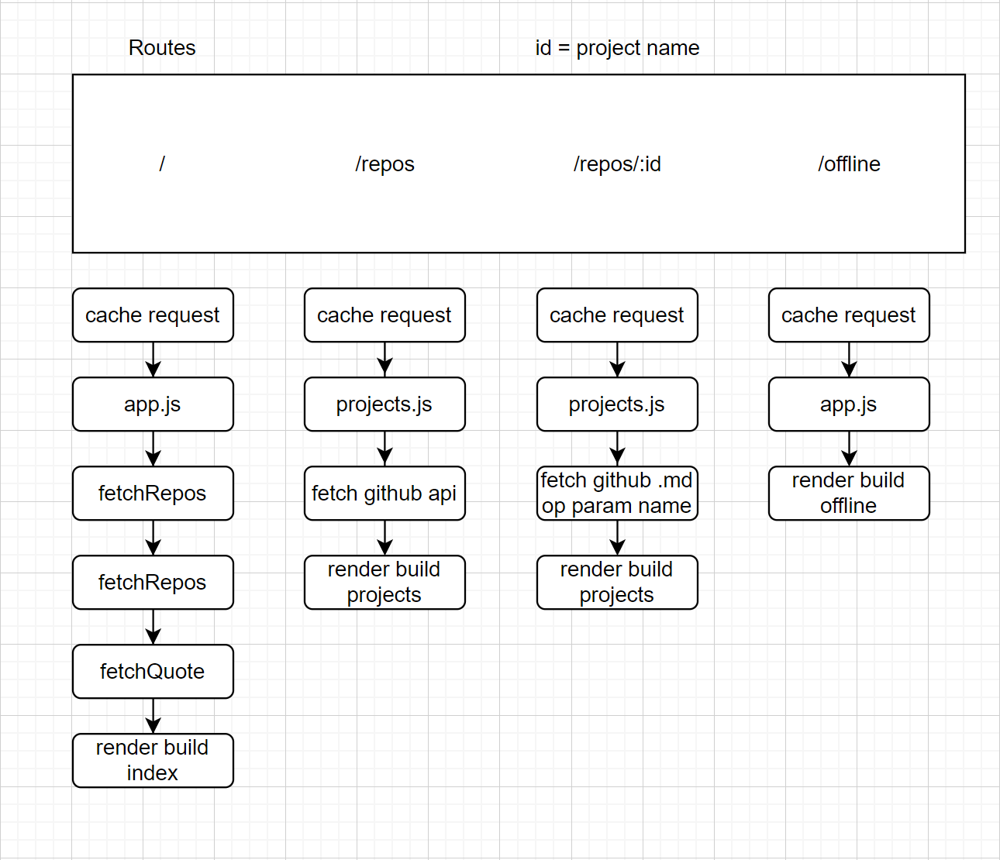
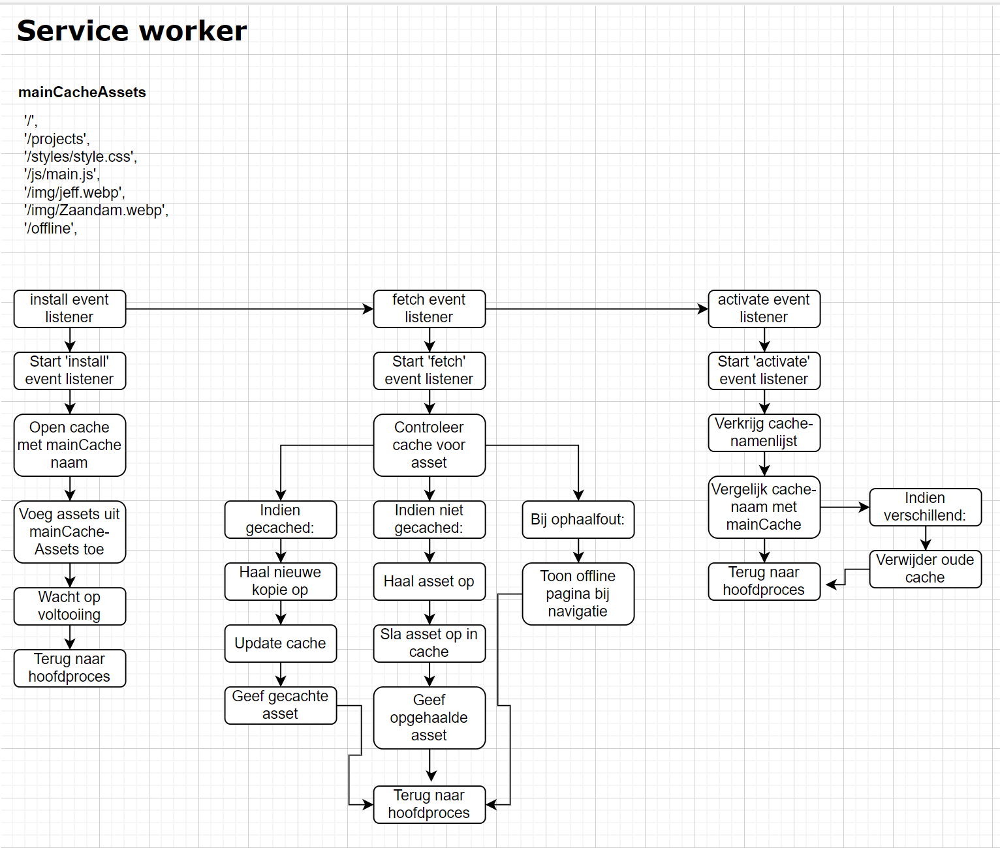
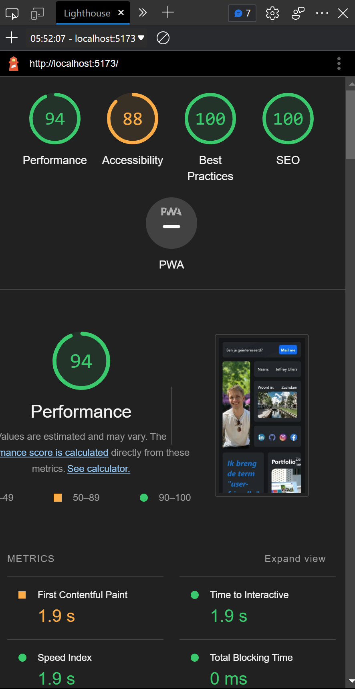
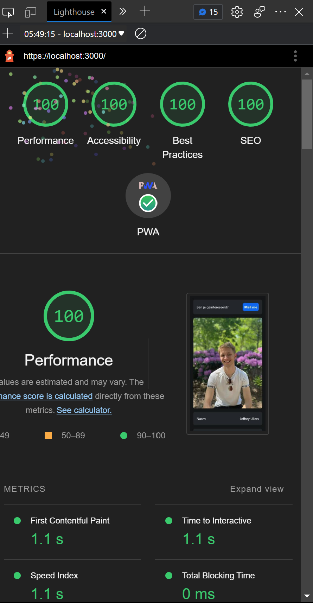

# Progressive Web Apps Course - Portfolio Project

This project is part of the Progressive Web Apps course at Amsterdam University of Applied Sciences. The goal is to build a server-side rendered application using Node.js, TypeScript, and Express, and then gradually enhance it to become a Progressive Web App (PWA).

**Installatie**
1. Clone de repo
2. gebruik de volgende commando's:
	1. mkcert -install 
	2. mkcert localhost
3. gebruik daarna 'npm run dev' om een lokale server te starten.

[Klik hier voor de live demo](https://portfolio.gekkeboyjeff.repl.co)

## Table of Contents

- [About](#About)
- [Client side rendering](#Client side rendering)
- [Activity diagram](#activity diagram)
- [Service worker](#service worker)
- [Critical rendering path](#criticalRenderingPath)
- [Uitdaging week 1](#Week1)


## About
Deze Progressive Web App (PWA) is ontworpen om mijn professionele portfolio weer te geven en te laten zien welke projecten en vaardigheden ik heb verworven gedurende mijn carrière. Het unieke kenmerk van deze PWA is dat het gebruikmaakt van de GitHub API om real-time gegevens over mijn projecten en bijdragen op te halen. Hierdoor wordt de inhoud van mijn portfolio automatisch bijgewerkt met de meest recente informatie over mijn werk.

### Features
[x] Recente data ophalen
[x] Lees de meest recente informatie over mijn projecten
[x] Random quote als opvrolijker
[x] Gecachde pagina's voor een snellere ervaring.

## Client side rendering
Server-side rendering (SSR) is de techniek waarbij een webpagina op de server wordt weergegeven voordat deze naar de client wordt verzonden, wat resulteert in snellere laadtijden en betere SEO. In dit geval gebruik ik SSR om mijn ​​portfoliowebsite te genereren op basis van mijn GitHub API-gegevens. Node.js en Express worden gebruikt om de webserver in te stellen en EJS werkt als een templating-engine voor het maken van dynamische HTML-inhoud. SSR leidt tot verbeterde prestaties en zichtbaarheid van zoekresultaten.

## activity diagram



## service worker

De 'stale while revalidate'-techniek is een cachingstrategie die ik heb toegepast om de prestaties en gebruikerservaring van mijn webproject te verbeteren. Deze techniek biedt een balans tussen het snel leveren van content en het up-to-date houden van de cache.

Bij 'stale while revalidate' wordt een gecachte versie van de bron onmiddellijk naar de gebruiker gestuurd, terwijl tegelijkertijd op de achtergrond een update van de bron uit het netwerk wordt opgehaald en de cache wordt bijgewerkt. Dit zorgt voor snelle laadtijden en een soepele gebruikerservaring, omdat gebruikers niet hoeven te wachten op het ophalen van de meest recente versie van een bron.

Tegelijkertijd zorgt deze techniek ervoor dat de cache regelmatig wordt bijgewerkt, waardoor gebruikers de meest recente content krijgen bij hun volgende bezoek. Dit is een effectieve oplossing voor het balanceren van snelheid en actualiteit van content, waardoor de algehele prestaties en gebruikerservaring van het webproject worden verbeterd.



## critical rendering path

| old    |  new   |
| --- | --- |
|     |      |


Om de critical rendering path te optimaliseren en een snellere laadtijd en betere gebruikerservaring te bieden, heb ik verschillende stappen ondernomen om mijn webproject te verbeteren. Hier is een uitgebreid overzicht van de stappen die ik heb gevolgd en de technieken die ik heb toegepast:

1.  Gulp-taken voor het verkleinen van bestanden: Ik heb Gulp gebruikt om verschillende taken te definiëren om JavaScript-, CSS- en EJS-bestanden te verkleinen. Dit resulteert in kleinere bestanden die sneller door de browser kunnen worden gedownload en verwerkt. Met behulp van Gulp-pakketten zoals gulp-concat, gulp-minify en gulp-clean-css, worden de bestanden samengevoegd en gecomprimeerd voordat ze naar hun respectievelijke build-mappen worden verplaatst. 

```JS
import gulp from 'gulp';
import concat from 'gulp-concat';
import minify from 'gulp-minify';
import cleanCss from 'gulp-clean-css';
import minifyejs from 'gulp-minify-ejs';

gulp.task('pack-js', function () {    
    return gulp.src(['public/js/*.js'])
        .pipe(concat('main.js'))
        .pipe(minify({
            ext:{
                min:'.js'
            },
            noSource: true
        }))
        .pipe(gulp.dest('public/build/js'));
});
 
gulp.task('pack-css', function () {    
    return gulp.src(['public/styles/*.css'])
        .pipe(concat('style.css'))
        .pipe(cleanCss())
        .pipe(gulp.dest('public/build/css'));
});
gulp.task('minify-pages', function() {
    return gulp.src(['views/*.ejs'])
        .pipe(minifyejs())
        //.pipe(rename({suffix:".min"}))
        .pipe(gulp.dest('views/build'))
})
gulp.task('minify-static', function() {
    return gulp.src(['views/partials/*.ejs'])
        .pipe(minifyejs())
        //.pipe(rename({suffix:".min"}))
        .pipe(gulp.dest('views/build/partials'))
});
gulp.task('default', gulp.series('pack-js', 'pack-css', 'minify-pages', 'minify-static'));
```
 
4. Afbeeldingen optimaliseren: Om de laadtijd van afbeeldingen te verminderen, heb ik alle statische afbeeldingen verkleind en geconverteerd naar het moderne en efficiënte WebP-formaat. Dit zorgt voor een aanzienlijke vermindering van de bestandsgrootte zonder kwaliteitsverlies, wat resulteert in snellere laadtijden en minder bandbreedteverbruik.
5.  Crossorigin-attribuut voor gefetchte afbeeldingen: Om de cache te verkleinen, heb ik het crossorigin="anonymous"-attribuut toegevoegd aan alle gefetchte afbeeldingen. Dit zorgt ervoor dat de browser geen extra referentie-informatie opslaat en de cache efficiënter maakt.
6.  Caching van belangrijke bronnen en bestanden: Om de laadtijden voor terugkerende bezoekers te verbeteren, heb ik de volgende pagina's en bestanden gecached:
    -   Homepagina
    -   Projectenpagina
    -   Belangrijke CSS- en JavaScript-bestanden
    -   Enkele afbeeldingen
    -   Een offline pagina voor het geval er geen internetverbinding is
7.  Server-side rendering (SSR) voor content en quotes: Ten slotte heb ik gebruikgemaakt van SSR om de inhoud van mijn webpagina's te genereren. Dit betekent dat alle benodigde HTML-inhoud op de server wordt gemaakt voordat deze naar de client wordt gestuurd, wat resulteert in snellere laadtijden en een betere SEO. Voorheen was het genereren van quotes client-side, maar nu is dit ook server-side, wat bijdraagt aan een efficiëntere en snellere weergave van de pagina.

## Week1

### Exercise 1: Refactor the WAFS App to a server side version with Node.js & Express

- [x] Forked the repo: [Progressive Web Apps 2022](https://github.com/your-username/progressive-web-apps-2022)
- [x] Refactored the app
- [x] Updated CSS
- [x] Improved app with client-side JavaScript

#### Progress Update

Ik begon met het forken van de repo. Daarna heb ik mijn oude portfolio project toegevoegd en begon ik deze om te bouwen naar pwa (met behulp van de opdrachten deze week.).

Het begin was vrij lastig. Ik wou gebruik maken van vite en typescript maar snapte na een tijd strugglen de logica er niet achter. Op advies van Declan heb ik het zonder vite en typescript gedaan zodat ik meer tijd had voor de opdracht zelf.

Het begin daarvan was wel vrij simpel. Een nodeJS applicatie opzetten was zo gedaan, echter moest ik wel nog wat onderzoek doen naar requests, responses en routing.

Omdat mijn oude code nog gebruik maakte van hash routing moest ik dit ombouwen naar nodeJS routing. het mocht namelijk ook geen single page applicatie meer zijn. 

Hiervoor moest ik dus gebruik maken van express om een server op te zetten en ejs als templating engine. Het koppelen van de data aan de back-end aan ejs was nieuw voor mij en het duurde even voordat ik door had hoe je dit nou precies deed. 

#### Challenges and Learnings

Het ombouwen van mijn gehele CSS was nogal een behoorlijke taak. Ik had geen gebruik gemaakt van classes in mijn vorige project. dus veranderde mijn code van het één naar het ander. 
Hieronder een klein deel van de verandering:

before:
```HTML
<section>
	<div class="background">
	  <h2>Ervaring in een oogopslag</h2> 
	  <blockquote cite="#">
		<p></p>
	  </blockquote>
	</div>
	<ul>
	  <li><h3>2+ jaar erva  ring</h3></li>
	  <li><h3>2 projecten afgerond</h3></li>
	  <li><h3>1 client</h3></li>
	</ul>
</section>
```

```CSS
main>section:first-of-type>ul li h3::after,
main>section:first-of-type>ul li h3::before {
  content: '';
  display: flex;
  height: 0.3em;
  width: 100%;
  background: rgb(255 255 255 / .6);
  position: relative;
  border-radius: 2em;
  transition: .5s;
}

h3 {
  position: relative;
  width: 100%;
}

main>section:first-of-type>ul li:hover h3::after {
  transform: translateX(-18em);
}

main>section:first-of-type>ul li:hover h3::before {
  transform: translateX(18em);
}

main>section:first-of-type>ul li h3::after {
  right: -12em;
  top: .5em;
}

main>section:first-of-type>ul li h3::before {
  left: -12em;
  bottom: .5em;
}
```
After
```HTML
<section class="column flex50">
  <div class="background">
	<h2 class="hidden">Ervaring in een oogopslag</h2> 
	<blockquote cite="#">
	  <p>
		<%- quote %>
	  </p>
	</blockquote>
  </div>
  <ul class="height50">
	<li><h3>2+ jaar ervaring</h3></li>
	<li><h3>2 projecten afgerond</h3></li>
	<li><h3>1 client</h3></li>
  </ul>
</section>
```

```CSS
.height50 li h3::after,
.height50 li h3::before {
    content: '';
    display: flex;
    height: 0.3em;
    width: 100%;
    background: rgb(255 255 255 / .6);
    position: relative;
    border-radius: 2em;
    transition: .5s;
}

h3 {
    position: relative;
    width: 100%;
}

.height50 li:hover h3::after {
    transform: translateX(-18em);
}

.height50 li:hover h3::before {
    transform: translateX(18em);
}

.height50 li h3::after {
    right: -12em;
    top: .5em;
}

.height50 li h3::before {
    left: -12em;
    bottom: .5em;
}
```
---

De hash routing moest ook weg omdat dus gebruik ging maken van meerdere pagina's. Omdat ik met nodeJS en ejs ging werken gingen werkte mijn routes met behulp van express en ejs.

Before:
```JS
export async function router() {
    const hash: string = window.location.hash; // Get the hash from the URL
    const parts: string[] = hash.split('/'); // Split the hash into an array of parts
    
    if (hash === '') {
        window.location.hash = '#home';
    }

    const section6 = document.querySelector('section:nth-of-type(6)')!;

    switch (parts[0]) {
        case '#home':
            console.log('home');
            fetchPinnedRepositories('GekkeBoyJeff');
            checkForItems();
            section6.innerHTML = '<div></div>';
            break;
        case '#projects':
            fetchAllRepositories('GekkeBoyJeff');
            checkForItems();
            if (parts.length > 1) {
                const page: string = parts[1];
                console.log(`project/${page}`);
                fetchCurrentRepository('GekkeBoyJeff', page);
            } else {
                console.log('projects');
                section6.innerHTML = '<div></div>';
            }
            break;
        default:
            console.log("can't find hash \nredirecting to home");
            window.location.hash = '#home';
            break;
    }
}
```

After:
```JS
app.get('/', async (req, res) => {
  const username = 'GekkeBoyJeff'

  try {
    const repos = await fetchRepos(username)
    const repoImages = mapRepoImages(username, repos)

    const quote = await fetchQuote();
    res.render('index', { repos, repoImages, quote })
  } catch (error) {
    console.error(error.message)
    res.status(500).end()
  }
})

app.use('/projects', projectsRouter);
```

---


```JS
const CORE_CACHE_NAME = 'core-cache';
const CORE_ASSETS = [/* css, bundle.js offline page */]

self.addEventListener('install', event =>{
	event.waitUntill(
	caches.open(CORE_CACHE_NAME)
	.then(cache => cache.addAll(CORE_ASSETS))
	.then(() => self.skipWaiting())
	)
});
```

Serve from cache
```JS
	self.addEventListener('fetch', event =>{
		const request = event.request;
			if(isInCoreCache(request)){
			event.respondWith(
				caches.open(CORE_CACHE_NAME)
					.then(cache => cache.match(request.url))
			)
		}
	})
```

Runtime caching
```JS
self.addEventListener('fetch', event =>{
	const request = event.request;
	if(isSomethingParticular(request) && isNotCached(request)){
	event.respondWith(
	return fetch(request).then(response =>{
	return caches.open('mycache')
	.then(cache =>{
	cache.put(request, response.clone())
	})
	.then(() => response )}))}
})
```

Hijack fetch 
```JS
self.addEventListener('fetch', event =>{
	const request = event.request;
	event.respondWith(
		console.log('doe hier je dingen')
	);
});
```

```JS
self.addEventListener(‘install’, event => {
 // on installation
});
self.addEventListener(‘activate’, event => {
 // on activation
});
self.addEventListener(‘fetch’, event => {
 // on outgoing request
});
self.addEventListener(‘push’, event => {
 // on push message received
});
self.addEventListener(‘message’, event => {
 // on message from app
});
self.addEventListener(‘sync’, event => {
 // 
})
```


